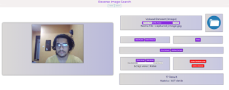
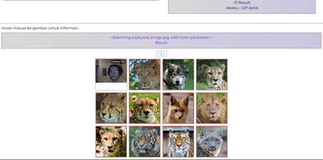
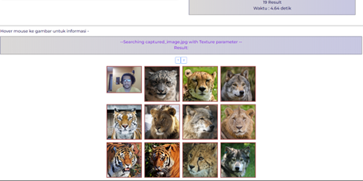
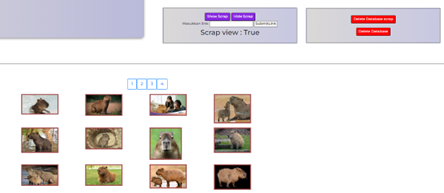
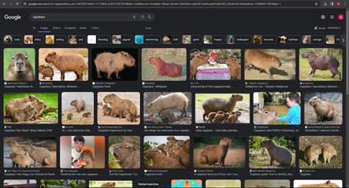

# Algeo02-22129
Tugas Besar 2 IF2123 - Kelompok CupcakKe
| NIM | Nama |
| :---: | :---: |
| 13522129 | Hugo Sabam Augusto |
| 13522144 | Nicholas Reymond Sihite |
| 13522151 | Samy Muhammad Haikal |

## Nama Program
CONTENT BASED IMAGE RETRIEVAL MENGGUNAKAN PARAMETER WARNA DAN TEXTUR

## Deskripsi
Program ini melakukan <i>CBIR</i> menggunakan parameter <i>warna</i> dan <i>textur</i> yang memanfaatkan konsep dari <i>cosine similarity</i> untuk mengetahui tingkat kemiripan dua buah gambar. Program ini dibuat menggunakan bahasa pemrograman Python, html, css, dan javascript.

## Cara Menjalankan
Berikut adalah cara menjalankan program ini,
1. Clone repo ini ke directory lokal `git clone https://github.com/miannetopokki/Algeo02-22129.git`
2. Change directory ke `src`
3. Install dependencies `pip install -r .\requirements.txt`
4. Jalankan app.py `python app.py`

## Project Status
| Fitur | Status |
| :---: | :---: |
| CBIR Warna | Selesai |
| CBIR Textur | Selesai |
| Website CBIR | Selesai |
| Bonus 1 (Kamera) | Selesai |
| Bonus 2 (Image Scraping) | Selesai |

## Technologies Used
Python,HTML,CSS,Javascript,Bootstrap

## Example Results
## --Camera Search by Color--

## --Camera Search by Texture--

## --Image Scraping--

